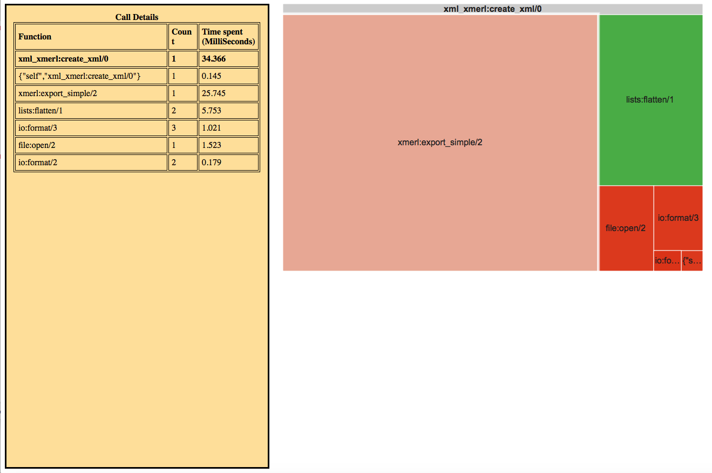

# fprofiler
Erlang fprof reporting

## Description
Erlang fprof is a time profiling tool. The output of fprof is very difficult to analyze. fprofiler is a simple tool used to view the fprof output in a graphical chart.
It uses google charts library for the html report.

The data policy is as per [Google Charts Security and Privacy](https://developers.google.com/chart/interactive/docs/security_privacy)

##usage
```
fprofiler:profile(M, F, A).
```
or
```
escript fprofiler.erl Mod Fun
```

## Sample Ouptput
```
Reading trace data.....
End of trace!
Processing data...
Creating output...
Done!
Analysis report created; open "fprof.html"
```

